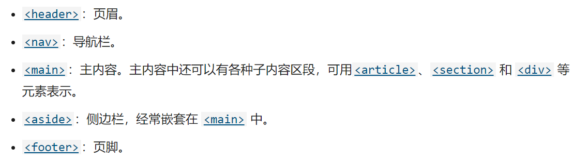

## HTML 基础学习

> HTML(HyperText Markup Language) 超文本传输协议
>
> [参考：学习HTML：指南与教程](https://developer.mozilla.org/zh-CN/docs/Learn/HTML)

#### 基础知识

- `<head></head>` — `<head>` 元素。该元素的内容对用户**不可见**，其中包含例如面向搜索引擎的搜索关键字（[keywords](https://developer.mozilla.org/zh-CN/docs/Glossary/Keyword)）、页面描述、CSS 样式表和字符编码声明等。


- HTML不是编程语言，是一种告知浏览器如何组织页面的标记语言
- HTML由一系列元素构成，标签不区分大小写，为规范，**均使用小写**
- 元素：一般由开始标签、内容、结束标签共同组成
- 不是每个元素都有开始标签、内容、结束标签。**空标签**例如：插入图片，通常包含了：src（必须）、alt(描述细节)属性，alt 属性指定了替代文本，用于在图像无法显示或者用户禁用图像显示时，代替图像显示在浏览器中的内容。
- 内联元素（`<em>、<strong>`等）和块级元素（`<p>`等）的区别

- 关于元素<a>是锚，它使被标签包裹的内容成为一个超链接。此元素也可以添加大量的属性，其中几个如下：
  - `href`: 这个属性声明超链接的web地址，当这个链接被点击浏览器会跳转至href声明的web地址。例如：`href="https://www.mozilla.org/"`。
  - `title`: 标题`title`属性为超链接声明额外的信息，比如你将链接至的那个页面。例如：`title="The Mozilla homepage"`。当鼠标悬停在超链接上面时，这部分信息将以工具提示的形式显示。
  - `target`: 目标`target`属性用于指定链接如何呈现出来。例如，`target="_blank"`将在**新标签页**中显示链接。如果你希望在**当前**标签页显示链接，忽略这个属性即可。

- URL 统一资源定位系统

  URL可以指向HTML文件、文本文件、图像、文本文档、视频和音频文件以及可以在网络上保存的任何其他内容。 如果浏览器不知道如何显示或处理文件，它会询问您是否要打开文件（需要选择合适的本地应用来打开或处理文件）或下载文件（以后处理它）。


#### 网站架构

为了实现语义化标记，HTML 提供了明确这些区段的专用标签，例如：




#### 多媒体嵌入

常用的标签有`<video>放置视频  <audio>放置音频`，相关内容在代码练习中已有体现

重点记录之前不了解的内容：”**音轨文本**“，个人理解和字幕文件很像。想起来在部分网站上看绝命毒师的时候，只有电脑端的网页可以正常显示字幕，平板端字幕错位，手机端干脆就没有字幕。大概和这部分原因相关，**插个眼**，以后看看能不能解决。

HTML5提供了WebVTT格式，使用`<track>标签`

> WebVTT 是一个格式，用来编写文本文件，这个文本文件包含了众多的字符串，这些字符串会带有一些元数据，它们可以用来描述这个字符串将会在视频中显示的时间，甚至可以用来描述这些字符串的样式以及定位信息。这些字符串叫做 **cues** ，你可以根据不同的需求来显示不同的样式，最常见的如下：
>
> - **subtitles**
>
>   通过添加翻译字幕，来帮助那些听不懂外国语言的人们理解音频当中的内容。
>
> - **captions**
>
>   同步翻译对白，或是描述一些有重要信息的声音，来帮助那些不能听音频的人们理解音频中的内容。
>
> - **timed descriptions**
>
>   将文字转换为音频，用于服务那些有视觉障碍的人。

一个示例：

```HTML
<video controls>
    <source src="example.mp4" type="video/mp4">
    <source src="example.webm" type="video/webm">
    <track kind="subtitles" src="subtitles_en.vtt" srclang="en">
</video>
```

