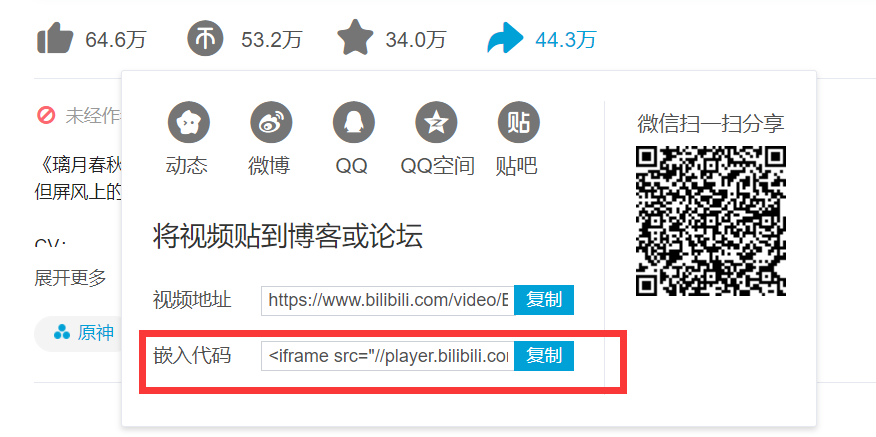

## HTML 基础学习

> HTML(HyperText Markup Language) 超文本传输协议
>
> [参考：学习HTML：指南与教程](https://developer.mozilla.org/zh-CN/docs/Learn/HTML)

#### 基础知识

- `<head></head>` — `<head>` 元素。该元素的内容对用户**不可见**，其中包含例如面向搜索引擎的搜索关键字（[keywords](https://developer.mozilla.org/zh-CN/docs/Glossary/Keyword)）、页面描述、CSS 样式表和字符编码声明等。


- HTML不是编程语言，是一种告知浏览器如何组织页面的标记语言
- HTML由一系列元素构成，标签不区分大小写，为规范，**均使用小写**
- 元素：一般由开始标签、内容、结束标签共同组成
- 不是每个元素都有开始标签、内容、结束标签。**空标签**例如：插入图片，通常包含了：src（必须）、alt(描述细节)属性，alt 属性指定了替代文本，用于在图像无法显示或者用户禁用图像显示时，代替图像显示在浏览器中的内容。
- 内联元素（`<em>、<strong>`等）和块级元素（`<p>`等）的区别

- 关于元素<a>是锚，它使被标签包裹的内容成为一个超链接。此元素也可以添加大量的属性，其中几个如下：
  - `href`: 这个属性声明超链接的web地址，当这个链接被点击浏览器会跳转至href声明的web地址。例如：`href="https://www.mozilla.org/"`。
  - `title`: 标题`title`属性为超链接声明额外的信息，比如你将链接至的那个页面。例如：`title="The Mozilla homepage"`。当鼠标悬停在超链接上面时，这部分信息将以工具提示的形式显示。
  - `target`: 目标`target`属性用于指定链接如何呈现出来。例如，`target="_blank"`将在**新标签页**中显示链接。如果你希望在**当前**标签页显示链接，忽略这个属性即可。

- URL 统一资源定位系统

  URL可以指向HTML文件、文本文件、图像、文本文档、视频和音频文件以及可以在网络上保存的任何其他内容。 如果浏览器不知道如何显示或处理文件，它会询问您是否要打开文件（需要选择合适的本地应用来打开或处理文件）或下载文件（以后处理它）。


#### 网站架构

为了实现语义化标记，HTML 提供了明确这些区段的专用标签，例如：


#### 多媒体嵌入

常用的标签有`<video>放置视频  <audio>放置音频`，相关内容在代码练习中已有体现

重点记录之前不了解的内容：”**音轨文本**“，个人理解和字幕文件很像。想起来在部分网站上看绝命毒师的时候，只有电脑端的网页可以正常显示字幕，平板端字幕错位，手机端干脆就没有字幕。大概和这部分原因相关，**插个眼**，以后看看能不能解决。

HTML5提供了WebVTT格式，使用`<track>标签`

> WebVTT 是一个格式，用来编写文本文件，这个文本文件包含了众多的字符串，这些字符串会带有一些元数据，它们可以用来描述这个字符串将会在视频中显示的时间，甚至可以用来描述这些字符串的样式以及定位信息。这些字符串叫做 **cues** ，你可以根据不同的需求来显示不同的样式，最常见的如下：
>
> - **subtitles**
>
>   通过添加翻译字幕，来帮助那些听不懂外国语言的人们理解音频当中的内容。
>
> - **captions**
>
>   同步翻译对白，或是描述一些有重要信息的声音，来帮助那些不能听音频的人们理解音频中的内容。
>
> - **timed descriptions**
>
>   将文字转换为音频，用于服务那些有视觉障碍的人。

一个示例：

```HTML
<video controls>
    <source src="example.mp4" type="video/mp4">
    <source src="example.webm" type="video/webm">
    <track kind="subtitles" src="subtitles_en.vtt" srclang="en">
</video>
```

####  内嵌框架

如果想要将B站的视频嵌入自己的HTML中，简单的复制网址是不可行的

```html
<!-- 参考示例代码 -->
<iframe src="https://player.bilibili.com/player.html?aid=19390801&cid=31621681&page=1" scrolling="no" border="0" frameborder="no" framespacing="0" allowfullscreen="true"> </iframe> 
<!-- scrolling 滚动条
frameborder 如果设置为1，则会告诉浏览器在此框架和其他框架之间绘制边框，这是默认行为。0删除边框  
-->
<p>改革春风吹满地</p>
```

发现`src`中的链接开头为`player`

通过分享链接可以得到**嵌入代码**（这部分后头要深入了解一下）



#### 矢量图

位图和矢量图的区别

- 位图使用像素网格来定义 — 一个位图文件精确得包含了每个像素的位置和它的色彩信息。流行的位图格式包括 Bitmap (`.bmp`), PNG (`.png`), JPEG (`.jpg`), and GIF (`.gif`.)
- 矢量图使用算法来定义 — 一个矢量图文件包含了图形和路径的定义，电脑可以根据这些定义计算出当它们在屏幕上渲染时应该呈现的样子。 [SVG](https://developer.mozilla.org/zh-CN/docs/Glossary/SVG) 格式可以让我们创造用于 Web 的精彩的矢量图形。

[SVG](https://developer.mozilla.org/zh-CN/docs/Web/SVG) 是用于描述矢量图像的[XML](https://developer.mozilla.org/zh-CN/docs/Glossary/XML)语言。 它基本上是像HTML一样的标记，只是你有许多不同的元素来定义要显示在图像中的形状，以及要应用于这些形状的效果。 SVG用于标记图形，而不是内容。 

```html
<!--示例代码：-->
<svg version="1.1"
     baseProfile="full"
     width="300" height="200"
     xmlns="http://www.w3.org/2000/svg">
    <!-- xmlns属性定义了一个命名空间，浏览器会将此命名空间用于该属性所在元素内的所有内容 -->
    <rect width="100%" height="100%" fill="black" />
    <circle cx="150" cy="100" r="90" fill="blue" />
</svg>

```

#### 表格

**语法**

```
<td scope="value">
```

**属性值**

| 值       | 描述                     |
| :------- | :----------------------- |
| col      | 规定单元格是列的表头。   |
| row      | 规定单元格是行的表头。   |
| colgroup | 规定单元格是列组的表头。 |
| rowgroup | 规定单元格是行组的表头。 |

